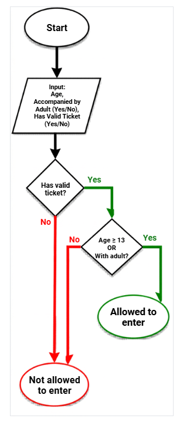
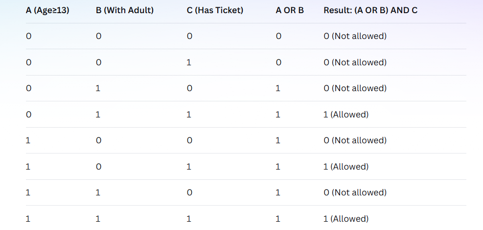

1. Identify the Components
1.1. Inputs:

Age (numeric value)
Accompanied by adult (boolean: yes/no)
Has valid ticket (boolean: yes/no)
1.2. Process:
The admission logic uses boolean operators:

(Age ≥ 13 OR Accompanied by adult) AND Has valid ticket
1.3. Output:

Allowed to enter (boolean: yes/no)

2.Design the Algorithm

2.1.

2.2. Truth Table:

Let me define variables:

A = Age ≥ 13
B = Accompanied by adult
C = Has valid ticket
Result = Allowed to enter

2.3. Algorithm (Step-by-Step):

START
INPUT age, accompaniedByAdult, hasValidTicket
IF hasValidTicket = FALSE THEN
OUTPUT "Not allowed to enter"
GO TO step 10
IF age ≥ 13 OR accompaniedByAdult = TRUE THEN
OUTPUT "Allowed to enter"
ELSE
OUTPUT "Not allowed to enter"
END
2.4. Pseudocode:

FUNCTION checkAdmission(age, accompaniedByAdult, hasValidTicket)
    IF NOT hasValidTicket THEN
        RETURN "Not allowed to enter - No valid ticket"
    END IF
    
    IF age >= 13 OR accompaniedByAdult THEN
        RETURN "Allowed to enter"
    ELSE
        RETURN "Not allowed to enter - Must be 13+ or with adult"
    END IF
END FUNCTION

3. Evaluate Expression - Test Cases
3.1. Test Samples:

Test 1: Age=15, With Adult=No, Ticket=Yes → Allowed (13 or older with ticket)
Test 2: Age=10, With Adult=Yes, Ticket=Yes → Allowed (child with adult and ticket)
Test 3: Age=10, With Adult=No, Ticket=Yes → Not Allowed (child alone)
Test 4: Age=15, With Adult=No, Ticket=No → Not Allowed (no ticket)
Test 5: Age=10, With Adult=Yes, Ticket=No → Not Allowed (no ticket)
Test 6: Age=20, With Adult=No, Ticket=Yes → Allowed (adult with ticket)